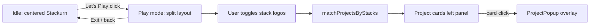

# Stackurn Play Mode — Implementation Plan

**Goal:** A themed **"Let's Play"** button on the right side of `StackurnSection.jsx`. Clicking enters **play mode**: Saturn + rings slide right, instruction text appears, user toggles stack items (0+ per layer), a frontend data layer finds matching projects, and results render as clickable cards on the left that open `ProjectPopup.jsx`.

---

## UX Flow



### Layout (desktop)

| Zone | Content |
|------|---------|
| **Left (~42%)** | Scrollable project results panel; empty state when no stacks selected |
| **Right (~58%)** | Instruction banner + shifted Stackurn system (Saturn CSS planet + 4 rings) + **Let's Play** / **Exit** control |

### Play mode behavior

1. **Enter:** `isPlayMode = true` — `.stackurn-inner` becomes a two-column grid; `.stackurn-system` animates `translateX` right (~8–12%) with CSS transition (~600ms, ease-out). Header copy switches to: *"Select stacks from the layers"* (plus sub-hint: *"Pick any combination — we'll find matching projects"*).
2. **Stack selection:** Logo chips become toggle buttons (multi-select). Selected state: ring-colored glow border + check badge. Drag-to-rotate still works on ring tracks.
3. **Live filtering:** On every selection change, run query → update left panel immediately (no submit button).
4. **Exit:** Button toggles back to idle layout; selection persists on exit.

### Mobile

- Stack vertically: instruction + rings on top, results below (full width).
- Reduce ring scale further if needed (existing `0.52` mobile scale).

---

## Data Layer (frontend-only, no separate backend)

**JSON file**, not SQLite — 9 projects, zero extra deps, Vite-friendly imports.

### Files

| File | Purpose |
|------|---------|
| `client/src/screens/landing-page/data/stackurnProjectIndex.json` | Normalized stack tags per project |
| `client/src/screens/landing-page/data/stackurnStackAliases.js` | Maps stackurn `slug` → searchable tokens / synonyms |
| `client/src/screens/landing-page/data/stackurnQuery.js` | `matchProjectsByStacks(selectedSlugs, projects)` |

### JSON schema (per project)

```json
{
  "projectId": 8,
  "stackSlugs": ["react", "python", "fastapi", "langchain", "openai", "pinecone", "redis", "docker"]
}
```

`PROJECTS` in `developerModels.js` remains the source of truth for card/popup display. JSON only stores **IDs + stack tags**.

---

## Matching Algorithm

**Mode: ALL selected stacks must match.**

```js
export function matchProjectsByStacks(selectedSlugs, projects, index) {
  if (!selectedSlugs.length) return [];

  const slugSet = new Set(selectedSlugs);
  const matchedIds = index
    .filter(({ stackSlugs }) => [...slugSet].every((s) => stackSlugs.includes(s)))
    .map(({ projectId }) => projectId);

  return projects.filter((p) => matchedIds.includes(p.id));
}
```

- **0 selections:** return `[]`, empty state: *"Select one or more stacks to discover projects"*
- **No matches:** *"No projects match this exact stack combo — try fewer filters"*

---

## UI Components

| Component | Role |
|-----------|------|
| `StackurnPlayButton` | Space-themed CTA — **Let's Play** / **Exit** |
| `StackurnResultsPanel` | Left column; reuses `ProjectCard` |
| `LogoItem` / `OrbitRing` | Toggle selection in play mode |
| `StackurnSection` | `isPlayMode`, `selectedSlugs`, `matchedProjects` |
| `LandingPage` | `onProjectClick={setSelectedProject}` → global `ProjectPopup` |

---

## Test Plan

1. Click **Let's Play** — layout splits, rings slide right, instruction visible
2. Select **React + Supabase** — Sportivex, KKs Online, OMGx variants appear
3. Add **LangChain** — narrows to AI projects only
4. Deselect all — empty state, no cards
5. Click a result card — `ProjectPopup` opens with correct project
6. **Exit** — returns to centered Stackurn
7. Mobile viewport — stacked layout, selection + results usable
